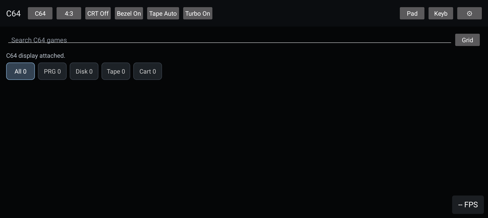
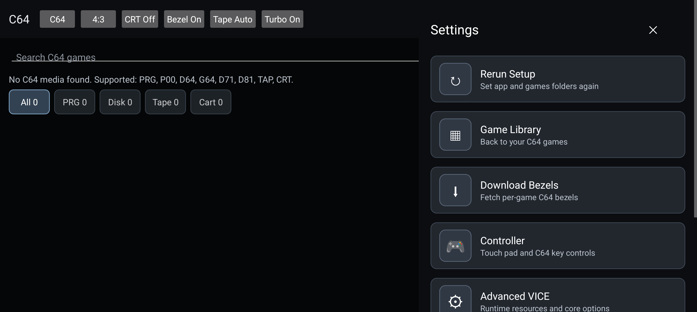
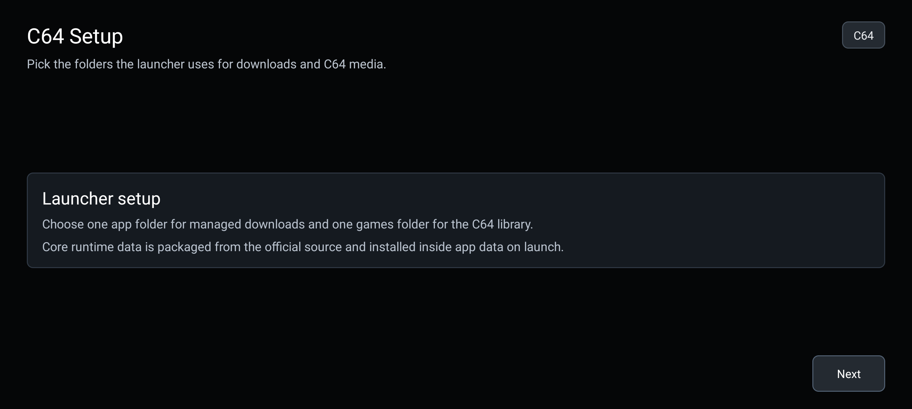
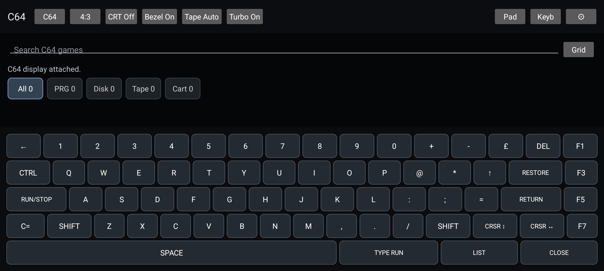

# VICE Android

Native Android C64 emulator built around the VICE x64sc core, with a touch-first launcher, virtual keyboard, tape and disk controls, configurable display modes, bezel support, and controller mapping.

## Screenshots

Captured from the Pixel 10 emulator.

| Launcher | Settings |
| --- | --- |
|  |  |

| First-run setup | Virtual keyboard |
| --- | --- |
|  |  |

## Build

```bash
./gradlew assembleDebug
```

Release builds are handled by the GitHub Actions Play Store workflow. Signing and IGDB credentials are supplied through repository secrets.

## Native Runtime

The app bundles arm64 VICE runtime libraries. The native build is pinned to NDK `28.2.13676358` and the VICE headless binary is linked with 16 KB page-size alignment for modern Android devices.

